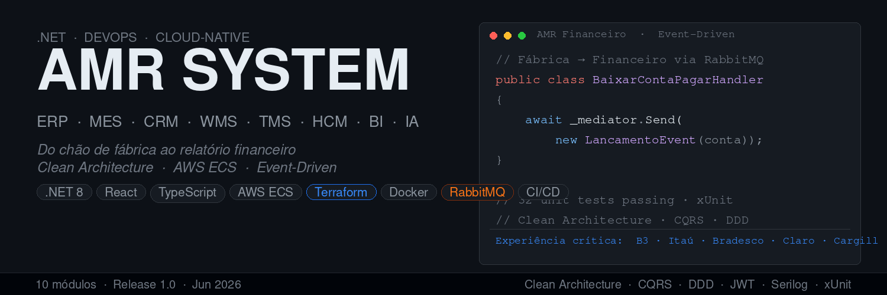

<div align="left">

<h3>Engenheiro de Software · .NET 10 + AWS · Next.js · São Paulo </h3>

Desenvolvedor com trajetória construída em ambientes de missão crítica no mercado financeiro — **B3, Itaú e Bradesco** — especialista em sustentação de sistemas legados, alta volumetria, bases de dados críticas (SQL Server, Oracle, Sybase) e ciclos de entrega controlados por GMUD.

Nos últimos anos evolui para um stack moderno full-stack e cloud-native. Hoje trabalho com **.NET 10 (C#)**, **Next.js/TypeScript**, **Clean Architecture** e **DevOps completo**: infraestrutura como código com **Terraform**, pipelines no **GitHub Actions** e deploy em **AWS ECS Fargate** com ALB, EFS e ECR.

Atualmente desenvolvo o **AMR SYSTEM** — ecossistema ERP corporativo com **11 módulos entregues**: Release 1.0 com 5 sistemas .NET em produção na AWS (Financeiro, Fábrica, Core, CRM, WMS), e Release 2.0 com TMS, HCM, RH, Compras e Eventos em Node.js 22 + Angular 17, mais o **AMR-Portal** (portal web do cliente em Next.js 14 + Vercel, Sprint 15). Infra unificada com ECS Fargate + Terraform. Mantenho também o **TodaAtividade** — marketplace B2C de atividades pedagógicas em Next.js 14 com Supabase, Mercado Pago e Cloudflare R2.

[](https://www.linkedin.com/in/progalexramos/)
[](https://github.com/al-ramos)

</div>

---

## 🏭 AMR ECOSYSTEM  
(Ecossistema ERP corporativo full-suite — MES · WMS · TMS · CRM · HCM · BI — cloud-native na AWS, do zero com Clean Architecture e event-driven).

> Elimina sistemas isolados. Unifica financeiro, produção, RH, compras, logística e analytics com rastreabilidade total via event-driven.

### 📦 Módulos

#### Release 1.0 — ✅ Concluída (Jun/2026)

| Módulo | Repo | Descrição | Status |
|--------|------|-----------|--------|
| 🧠 **AMR Core** | [AMR-Core](https://github.com/al-ramos/AMR-Core) | ERP base — produtos, fornecedores, clientes, estoque, pedidos, dashboard | ✅ Produção |
| 💰 **AMR Financeiro** | [AMR-Financeiro](https://github.com/al-ramos/AMR-Financeiro) | Contas a pagar/receber, lançamentos, fluxo de caixa, plano de contas | ✅ Produção |
| 🏭 **AMR Forms Fábrica** | [AMR-Forms-Fabrica](https://github.com/al-ramos/AMR-Forms-Fabrica) | MES — fichas de produção, inspeções, ordens de reparo, NF | ✅ Produção |
| 🤝 **AMR CRM** | [AMR-CRM](https://github.com/al-ramos/AMR-CRM) | CRM — leads, contatos, oportunidades, pipeline de vendas | ✅ Produção |
| 📦 **AMR WMS** | [AMR-WMS](https://github.com/al-ramos/AMR-WMS) | Gestão de armazém — recebimento, endereçamento, picking, integração Core | ✅ Produção |

#### Release 2.0 — ✅ Concluída (Jul/2026)

| Módulo | Descrição | Stack | Status |
|--------|-----------|-------|--------|
| 🚛 **AMR TMS** | Gestão de transporte — ordens de entrega, rastreamento, frete | Node.js 22 + Angular 17 | ✅ Produção |
| 👥 **AMR HCM** | Gestão de pessoas — funcionários, ponto, férias, departamentos | .NET 10 + React 19 | ✅ Produção |
| 🧑‍💼 **AMR RH** | Portal RH — perfil, afastamentos, holerite, headcount | Node.js 22 + Angular 17 | ✅ Produção |
| 🛒 **AMR Compras** | Gestão de compras — pedidos, fornecedores, aprovações | Node.js 22 + Angular 17 | ✅ Produção |
| 🎭 **AMR Eventos** | Gestão de eventos corporativos — inscrições, presenças | Node.js 22 + Angular 17 | ✅ Produção |
| 🖥️ **AMR Portal** | Portal web do cliente/funcionário — dashboard, SSO corporativo | Next.js 14 + Vercel | ✅ Sprint 15 |

---

## 🎓 TODAATIVIDADE
(Marketplace B2C de atividades pedagógicas em PDF para o ensino fundamental — Next.js 14 + Supabase + Mercado Pago).

> Professores e educadores encontram, visualizam uma prévia e compram materiais didáticos com download imediato após a confirmação do pagamento.

[](https://github.com/al-ramos/TodaAtividade-Ecommerce)
[](https://todaatividade.com.br)
[](https://github.com/al-ramos/TodaAtividade-Ecommerce)

### 🛠️ Stack

| Camada | Tecnologia |
|--------|-----------|
| Framework | Next.js 14 (App Router) + TypeScript |
| Estilo | Tailwind CSS + shadcn/ui |
| Auth | NextAuth.js (Google, Microsoft, Facebook, email/senha) |
| Banco | Supabase (PostgreSQL + RLS) |
| Storage | Cloudflare R2 (PDFs privados + prévias públicas) |
| Pagamento | Mercado Pago SDK v3 (Pix, Boleto, Cartão) |
| Email | Resend |
| Deploy | Vercel |
| CI | GitHub Actions |

### 📦 Sprints

| Sprint | Épico | Status |
|--------|-------|--------|
| Sprint 1 | 🔐 Auth — Cadastro, OAuth, recuperação de senha | ✅ |
| Sprint 2 | 📚 Catálogo + 📄 Preview PDF — Busca, filtros, prévia react-pdf | ✅ |
| Sprint 3 | 🛒 Checkout — Carrinho, Pix/Boleto/Cartão via MP Bricks | ✅ |
| Sprint 4 | 📦 Entrega + 📧 Email — Webhook HMAC, download R2, Resend | ✅ |
| Sprint 5 | ⚙️ Admin + 📱 SEO — Painel admin, upload R2, SEO, Meta Pixel | 🔄 |

---

## 🛠️ Stack Tecnológica

### Backend


### Frontend


### Cloud & Serviços


### Arquitetura & Padrões
```
Clean Architecture  ·  CQRS + MediatR  ·  DDD
Event-Driven (RabbitMQ + MassTransit)  ·  REST API  ·  JWT Bearer
App Router (Next.js)  ·  NextAuth.js  ·  SWR  ·  axios-retry
Angular 17 Standalone Components  ·  Angular Material  ·  Angular Signals
RLS (Supabase)  ·  Health Checks  ·  Serilog Structured Logging
Unit Testing (xUnit · Vitest · Jest)  ·  11 módulos entregues
```

---

## ☁️ Infraestrutura AWS — AMR SYSTEM

```
                        ┌─────────────────────────────────┐
                        │     GitHub Actions CI/CD        │
                        │  (deploy-aws.yml por repositório)│
                        └────────────┬────────────────────┘
                                     │ docker build + push
                                     ▼
                        ┌─────────────────────────────────┐
                        │         AWS ECR (10 repos)       │
                        │  Core · Financeiro · Fábrica    │
                        │  CRM · WMS (API + Web cada)     │
                        └────────────┬────────────────────┘
                                     │ pull image
                                     ▼
┌────────────────────────────────────────────────────────────┐
│                  Cluster ECS Fargate — amr-system           │
│                                                            │
│  ALB (:80)   ──► AMR-Financeiro  (API :5015)              │
│  ALB (:8081) ──► AMR-Core        (API :5001)              │
│  ALB (:8082) ──► AMR-Fábrica     (API :5186)              │
│  ALB (:8083) ──► AMR-CRM         (API :5187)              │
│  ALB (:8084) ──► AMR-WMS         (API :5188)              │
│                                                            │
│  EFS (volumes persistentes)  ·  Secrets Manager           │
└────────────────────────────────────────────────────────────┘
             Provisionado via Terraform (IaC)
```

---

## 🔄 Arquitetura de Eventos — AMR

```
AMR Forms Fábrica
  │  Saída de ficha de produção
  │  ──► RabbitMQ (MassTransit)
  │                │
  │                ▼
  │       AMR Financeiro
  │         ContaPagar criada automaticamente
  │
  │  NF Transmitida
  └──► RabbitMQ (MassTransit)
                  │
                  ▼
         AMR Financeiro
           ContaReceber criada automaticamente
           LancamentoFinanceiro de crédito gerado
```

---

## 💧 Hydac Services — Workflow Management (BPM)

> Plataforma de **BPM corporativo** desenvolvida para a **Hydac** (indústria hidráulica) em parceria com a **Mac Gestão**.
> Substitui 7 processos que rodavam em Excel puro por um sistema integrado com rastreabilidade total e controle de SLA.

[](https://hydac-services-hub.netlify.app/)
[](https://github.com/al-ramos/hydac-services-pb88)

### 📊 Escopo

| Processos especificados | Departamentos envolvidos | Etapas mapeadas |
|:-----------------------:|:------------------------:|:----------------:|
| **7** | **10** | **190+** |

### 🔄 Fluxo do Sistema

```
USUÁRIO grava ação
  ↓
CQRS Command executado
  ↓
Evento disparado via RabbitMQ (MassTransit)
  ↓
Próximo departamento recebe em tempo real (SignalR)
  ↓
Formulário carrega automaticamente (Blazor Server)
  ↓
Dados persistidos em MariaDB
```

### 🧰 Stack

| Camada | Tecnologia |
|--------|------------|
| Frontend | Blazor Server + MudBlazor |
| Backend | .NET 9 · CQRS · Clean Architecture |
| Messaging | RabbitMQ + MassTransit |
| Banco de Dados | MariaDB + EF Core 9 |
| Autenticação | Azure AD / LDAP |
| Deploy | Docker + GitHub Actions CI/CD |

### 📋 Status

| Fase | Status |
|------|--------|
| Discovery & Especificação | ✅ Completo (7 processos, 7 diagramas UML) |
| Prototipagem | ✅ Completo (Netlify v5.0 validado) |
| Proposta Comercial | ✅ Completo |
| Arquitetura & Design | ✅ Completo |
| Desenvolvimento | ⏳ Aguardando aprovação do cliente |

---

## 📊 GitHub Stats

<div align="center">


</div>

---

<div align="center">

*Construindo o futuro da gestão corporativa, um sprint de cada vez.*

</div>
