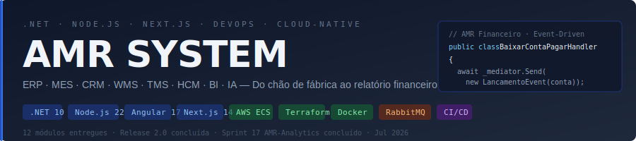

| 🏭 14 módulos entregues | 📋 14 sistemas planejados | ☁️ AWS ECS Fargate + Vercel | ⚡ Sprint 21 concluído |
|:---:|:---:|:---:|:---:|

---

**Engenheiro de Software · .NET 10 · Node.js 22 · Next.js · AWS · São Paulo**

Trajetória em missão crítica no mercado financeiro — **B3, Itaú e Bradesco**. Hoje: full-stack + cloud-native com Clean Architecture, Event-Driven e DevOps completo (ECS Fargate · Terraform · GitHub Actions).

---

## ⚡ Agora — Sprint 22

> **AMR-IA** (Sprint 19) + **AMR-Mobile** (Sprints 20–21) entregues · próximo: **Sprint 22** — Infra (Neon PostgreSQL + OpenTelemetry + Release 3.0)

---

## 🏭 AMR SYSTEM

> Ecossistema ERP corporativo full-suite — do chão de fábrica ao relatório financeiro. Cloud-native na AWS, Clean Architecture, Event-Driven.

### Release 1.0 · ✅ Jun/2026 · AWS ECS Fargate · .NET

| Módulo | Descrição | Stack |
|--------|-----------|-------|
| 🧠 **AMR Core** | ERP base — produtos, estoque, pedidos, clientes | .NET 10 · React 18 |
| 💰 **AMR Financeiro** | CP/CR, lançamentos, fluxo de caixa | .NET 8 · React 18 |
| 🏭 **AMR Fábrica** | MES — fichas de produção, inspeções, NF | .NET 8 · React 18 |
| 🤝 **AMR CRM** | Leads, oportunidades, pipeline de vendas | .NET 10 · React 19 |
| 📦 **AMR WMS** | Armazém — recebimento, endereçamento, picking | .NET 10 · React 19 |

### Release 2.0 · ✅ Jul/2026 · Node.js + Angular + Next.js

| Módulo | Descrição | Stack |
|--------|-----------|-------|
| 🚛 **AMR TMS** | Transporte — ordens de entrega, rastreamento, frete | Node.js 22 · Angular 17 |
| 👥 **AMR HCM** | Pessoas — funcionários, ponto, férias, departamentos | .NET 10 · React 19 |
| 🧑‍💼 **AMR RH** | Portal RH — perfil, holerite, afastamentos | Node.js 22 · Angular 17 |
| 🛒 **AMR Compras** | Pedidos, fornecedores, cotações, aprovações | Node.js 22 · Angular 17 |
| 🎭 **AMR Eventos** | Eventos corporativos — inscrições, presenças | Node.js 22 · Angular 17 |
| 🖥️ **AMR Portal** | Portal web do cliente/funcionário — SSO + dashboard | Next.js 14 · Vercel |

### PI 3 · Release 3.0 · em desenvolvimento

| Módulo | Descrição | Stack |
|--------|-----------|-------|
| 📊 **AMR Analytics** | Kafka KRaft + ClickHouse + Grafana dashboards + métricas | Node.js 22 · ClickHouse |
| 🤖 **AMR IA** | RAG pipeline — pgvector + LangChain.js + Claude API + Q&A | Node.js 22 · PostgreSQL 16 |
| 📱 **AMR Mobile** | App nativo — biometria + stores + push notifications + offline | Expo SDK 51 · React Native |

| Sprint | Foco | Status |
|--------|------|--------|
| Sprint 15 | AMR-Portal scaffold + auth + CI/CD Vercel | ✅ |
| **Sprint 16** | **AMR-Portal — Eventos, RH, Compras + PWA** | ✅ |
| Sprint 17–18 | AMR-Analytics — Kafka KRaft + ClickHouse + Grafana | ✅ |
| **Sprint 19** | **AMR-IA — pgvector + RAG + LangChain + Claude API** | ✅ |
| **Sprint 20–21** | **AMR-Mobile — Expo SDK + biometria + stores** | ✅ |
| Sprint 22 | Infra — Neon PostgreSQL + OpenTelemetry + Release 3.0 | 🔜 |

---

## 🎓 TODAATIVIDADE

> Marketplace B2C de atividades pedagógicas em PDF — Next.js 14 · Supabase · Mercado Pago · Cloudflare R2 · Vercel

---

## 🛠️ Stack

**Backend**

**Frontend**

**Cloud & DevOps**

**Arquitetura**
`Clean Architecture` · `CQRS + MediatR` · `DDD` · `Event-Driven (RabbitMQ + MassTransit)` · `App Router` · `NextAuth.js` · `SWR`

---

## 📊 GitHub Stats

---

*Construindo o futuro da gestão corporativa, um sprint de cada vez.*

