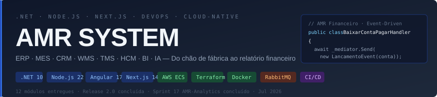

  

| 🏭 14 módulos em produção | ☁️ AWS ECS Fargate + Vercel | ⚡ Release 4.0 · PI 4 em andamento | 🚀 Sprint 23 |
|:---:|:---:|:---:|:---:|

---

**Engenheiro de Software · .NET 10 · Node.js 22 · Next.js · AWS · São Paulo**

Trajetória em missão crítica no mercado financeiro — **B3, Itaú e Bradesco**. 
Hoje: full-stack + cloud-native com Clean Architecture, Event-Driven e DevOps completo (ECS Fargate · Terraform · GitHub Actions).

---

<h2 align="center">⚡ Release 4.0 — PI 4 · em andamento</h2>

<em>Aprofundamento corporativo por módulo (v2). Com os 14 sistemas em produção, o PI 4 entrega a versão "v2" de cada domínio + o novo <strong>AMR-Fiscal</strong>. Sprint atual: <strong>23 — AMR-Financeiro v2</strong> (NF-e ✅ · Boleto ✅ · Conciliação ✅).</em>

| Sprint | Foco | Status |
|--------|------|--------|
| **Sprint 23** | **AMR-Financeiro v2 — NF-e, Boletos, Conciliação, DRE** | ▶️ em andamento |
| Sprint 24 | AMR-Fábrica v2 — BOM, OEE, Manutenção | 🔲 |
| Sprint 25 | AMR-Core v2 — Variantes, Preços, Multi-empresa | 🔲 |
| Sprint 26 | AMR-CRM v2 — Cotações, Contratos, Tickets SLA | 🔲 |
| Sprint 27 | AMR-HCM v2 — Folha completa, eSocial, Ponto | 🔲 |
| Sprint 28 | AMR-Compras v2 — RFQ, 3-way matching, Alçadas | 🔲 |
| Sprint 29 | AMR-WMS v2 — FIFO/FEFO, Endereçamento, Picking | 🔲 |
| Sprint 30 | AMR-TMS v2 — MDF-e, CT-e, Roteirização | 🔲 |
| Sprint 31 | **AMR-Fiscal (novo)** — SPED, Impostos | 🔲 |

---

<h2 align="center">✅ Release 3.0 — Concluída (PI 3)</h2>

<em>AMR-IA + AMR-Mobile + Neon PostgreSQL + OpenTelemetry + CHANGELOG + deploy guide. Ecossistema AMR completo — <strong>14 sistemas em produção</strong>.</em>

---

<h2 align="center">🏭 AMR SYSTEM</h2>

<em>Ecossistema ERP corporativo full-suite — do chão de fábrica ao relatório financeiro. Cloud-native na AWS, Clean Architecture, Event-Driven.</em>

<h3 align="center">Release 1.0 · ✅ Jun/2026 · AWS ECS Fargate · .NET</h3>

| Módulo | Descrição | Stack |
|--------|-----------|-------|
| 🧠 **AMR Core** | ERP base — produtos, estoque, pedidos, clientes | .NET 10 · React 18 |
| 💰 **AMR Financeiro** | CP/CR, lançamentos, fluxo de caixa | .NET 8 · React 18 |
| 🏭 **AMR Fábrica** | MES — fichas de produção, inspeções, NF | .NET 8 · React 18 |
| 🤝 **AMR CRM** | Leads, oportunidades, pipeline de vendas | .NET 10 · React 19 |
| 📦 **AMR WMS** | Armazém — recebimento, endereçamento, picking | .NET 10 · React 19 |

<h3 align="center">Release 2.0 · ✅ Jul/2026 · Node.js + Angular + Next.js</h3>

| Módulo | Descrição | Stack |
|--------|-----------|-------|
| 🚛 **AMR TMS** | Transporte — ordens de entrega, rastreamento, frete | Node.js 22 · Angular 17 |
| 👥 **AMR HCM** | Pessoas — funcionários, ponto, férias, departamentos | .NET 10 · React 19 |
| 🧑‍💼 **AMR RH** | Portal RH — perfil, holerite, afastamentos | Node.js 22 · Angular 17 |
| 🛒 **AMR Compras** | Pedidos, fornecedores, cotações, aprovações | Node.js 22 · Angular 17 |
| 🎭 **AMR Eventos** | Eventos corporativos — inscrições, presenças | Node.js 22 · Angular 17 |
| 🖥️ **AMR Portal** | Portal web do cliente/funcionário — SSO + dashboard | Next.js 14 · Vercel |

<h3 align="center">Release 3.0 · ✅ · PI 3 · Node.js + IA + Mobile</h3>

| Módulo | Descrição | Stack |
|--------|-----------|-------|
| 📊 **AMR Analytics** | Kafka KRaft + ClickHouse + Grafana dashboards + métricas | Node.js 22 · ClickHouse |
| 🤖 **AMR IA** | RAG pipeline — pgvector + LangChain.js + Claude API + Q&A | Node.js 22 · PostgreSQL 16 |
| 📱 **AMR Mobile** | App nativo — biometria + stores + push notifications + offline | Expo SDK 51 · React Native |

---

<h2 align="center">🎓 TODAATIVIDADE</h2>

<em>Marketplace B2C de atividades pedagógicas em PDF — Next.js 14 · Supabase · Mercado Pago · Cloudflare R2 · Vercel</em>

---

<h2 align="center">🛠️ Stack</h2>

<strong>Backend</strong>

<strong>Frontend</strong>

<strong>Cloud &amp; DevOps</strong>

<strong>Arquitetura</strong>

<code>Clean Architecture</code> · <code>CQRS + MediatR</code> · <code>DDD</code> · <code>Event-Driven (RabbitMQ + MassTransit)</code> · <code>App Router</code> · <code>NextAuth.js</code> · <code>SWR</code>

---

<h2 align="center">📊 GitHub Stats</h2>

---

<em>Construindo o futuro da gestão corporativa, um sprint de cada vez.</em>

